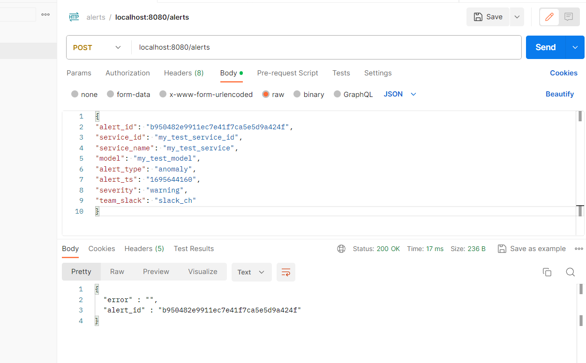
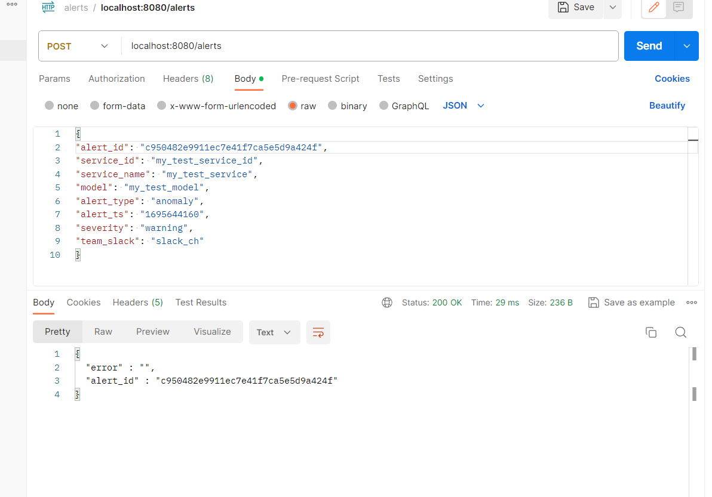
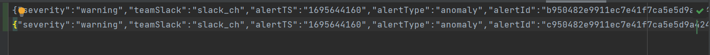
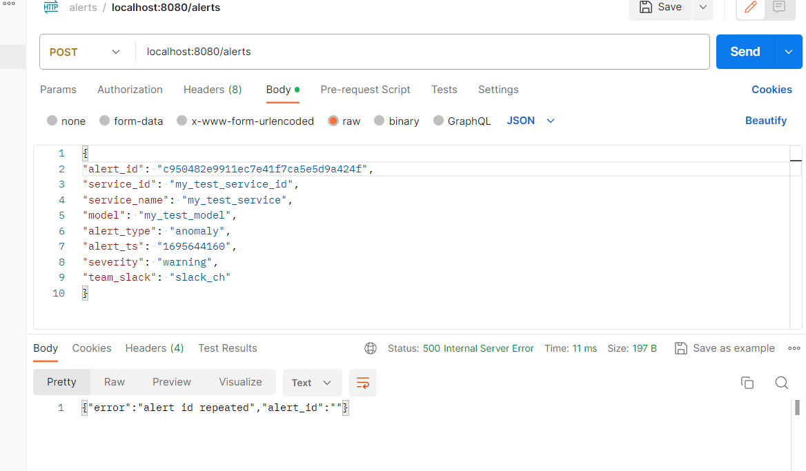
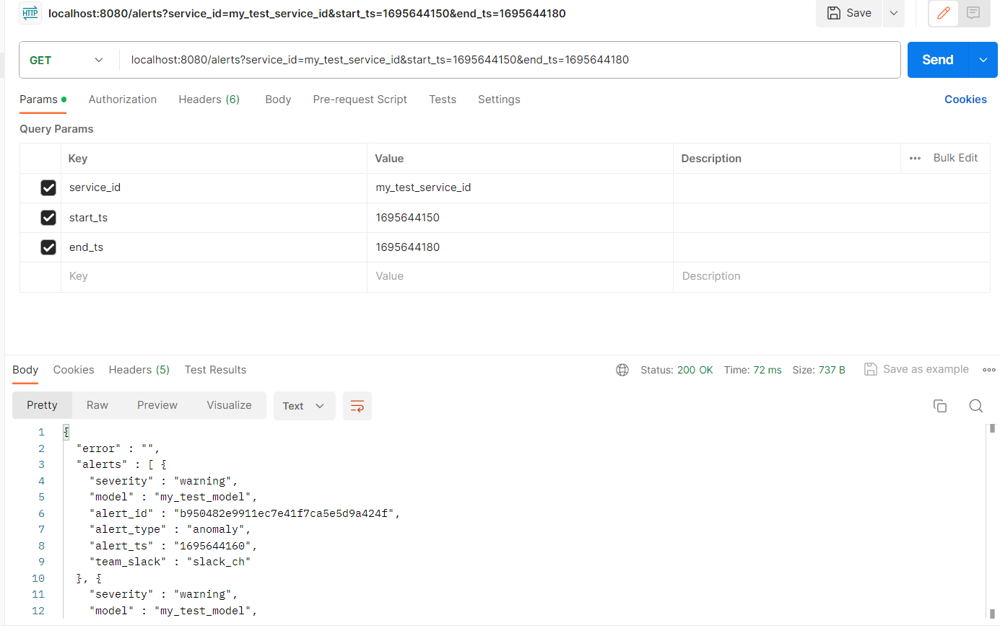
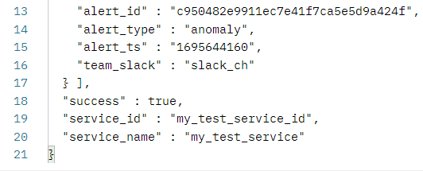
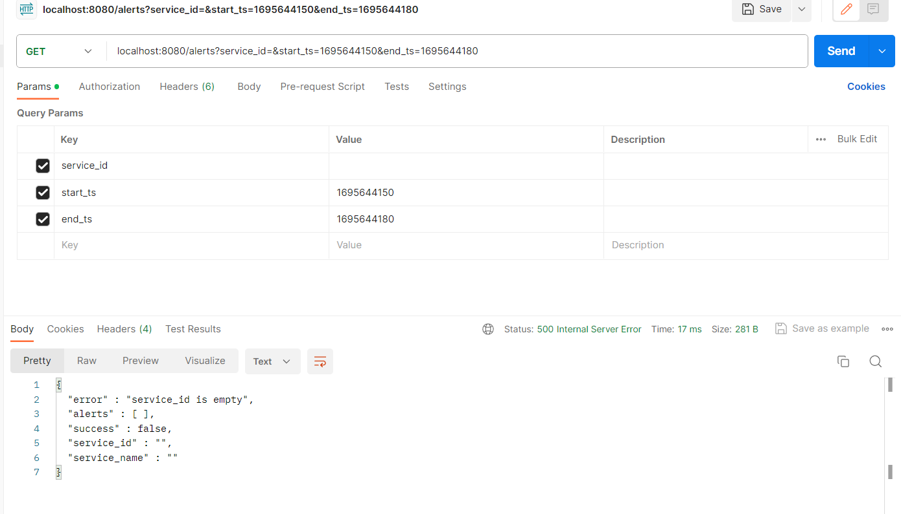

I used data.txt file as the data storage system to read and wirte alert data, the file is empty initially, and below are the results of the API I tested.

Write alerts

1. Write requests and reponses

data been added to the data.txt

2. Error

if I write the data with same alert_id, error will happen

Read Alerts

1. Read requests and reponse

2. Error

3. if I read the data without a service_id, error will happen

